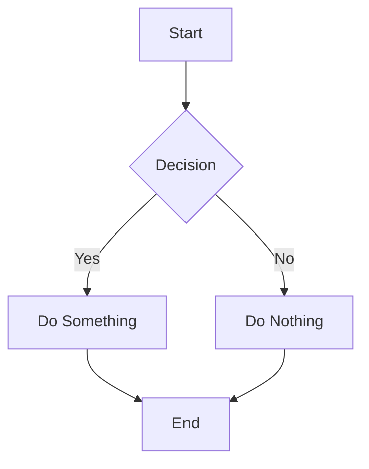

# MDX Components

This directory contains React components that can be used in MDX files.

## Components

### Math Expressions with remark-math

Math equations can be written directly in your markdown using the LaTeX syntax:

```jsx
// Inline math
$E = mc^2$

// Display math (centered block)
$$\sum_{i=1}^{n} i = \frac{n(n+1)}{2}$$

// Examples of more complex expressions
$$\int_a^b f(x) \, dx = F(b) - F(a)$$
$$\frac{d}{dx} \left( \int_{0}^{x} f(u) \, du \right) = f(x)$$
$$\begin{pmatrix}
  a & b \\
  c & d
\end{pmatrix}$$
```

### TwitterEmbed

Embeds a tweet from Twitter/X in your MDX content.

```jsx
// Basic usage
<TwitterEmbed tweetId="1781458937981829426" />

// With username (recommended)
<TwitterEmbed tweetId="1781458937981829426" />

// With dark theme
<TwitterEmbed tweetId="1781458937981829426" theme="dark" />

// Hide conversation
<TwitterEmbed tweetId="1781458937981829426" hideConversation={true} />
```

#### Example Twitter Accounts to Follow in AI

These are some influential AI Twitter accounts you might want to embed:

- **Sam Altman** (OpenAI CEO): `username="sama"` - `1649191520550866945`
- **Andrej Karpathy**: `username="karpathy"` - `1582778393683177472`
- **Andrew Ng**: `username="AndrewYNg"` - `1653112598032465922`
- **Fei-Fei Li**: `username="drfeifei"` - `1598374865366724608`
- **Demis Hassabis** (DeepMind): `username="demishassabis"` - `1631270467926892546`
- **Allie K. Miller**: `username="alliekmiller"` - `1590428877445705728`

### YouTubeVideo

Embeds a YouTube video with responsive sizing.

```jsx
<YouTubeVideo videoId="dQw4w9WgXcQ" title="Never Gonna Give You Up" />
```

### ModelArchitecture

Displays an interactive model architecture diagram.

```jsx
<ModelArchitecture
  layers={[
    { name: "Input", units: 784, activation: "linear" },
    { name: "Hidden 1", units: 128, activation: "relu" },
    { name: "Hidden 2", units: 64, activation: "relu" },
    { name: "Output", units: 10, activation: "softmax" },
  ]}
/>
```

### PerformanceChart

Shows performance metrics for models or algorithms.

```jsx
<PerformanceChart
  data={[
    { model: "Model A", accuracy: 0.92, speed: 0.85, size: 0.7 },
    { model: "Model B", accuracy: 0.88, speed: 0.95, size: 0.9 },
    { model: "Model C", accuracy: 0.96, speed: 0.75, size: 0.5 },
  ]}
/>
```

### ModelComparisonCard

Displays a comparison between two models.

```jsx
<ModelComparisonCard
  model1={{
    name: "GPT-3",
    params: "175B",
    training: "Unsupervised",
    release: "2020",
  }}
  model2={{ name: "GPT-4", params: "1.8T", training: "RLHF", release: "2023" }}
/>
```

### MermaidDiagram

Creates diagrams using Mermaid syntax.

````

````

### Blockquotes

Use standard markdown blockquotes with the `>` syntax:

```markdown
> Imagination is more important than knowledge.
>
> — Albert Einstein
```

Renders as:

> Imagination is more important than knowledge.
>
> — Albert Einstein

### Table Components

Styled table components for structured data.

```jsx
<table>
  <thead>
    <tr>
      <th>Model</th>
      <th>Year</th>
      <th>Parameters</th>
    </tr>
  </thead>
  <tbody>
    <tr>
      <td>BERT</td>
      <td>2018</td>
      <td>340M</td>
    </tr>
    <tr>
      <td>GPT-3</td>
      <td>2020</td>
      <td>175B</td>
    </tr>
  </tbody>
</table>
```

### CodeBlock

Syntax-highlighted code blocks.

````
```python
def hello_world():
    print("Hello, World!")
```
````
