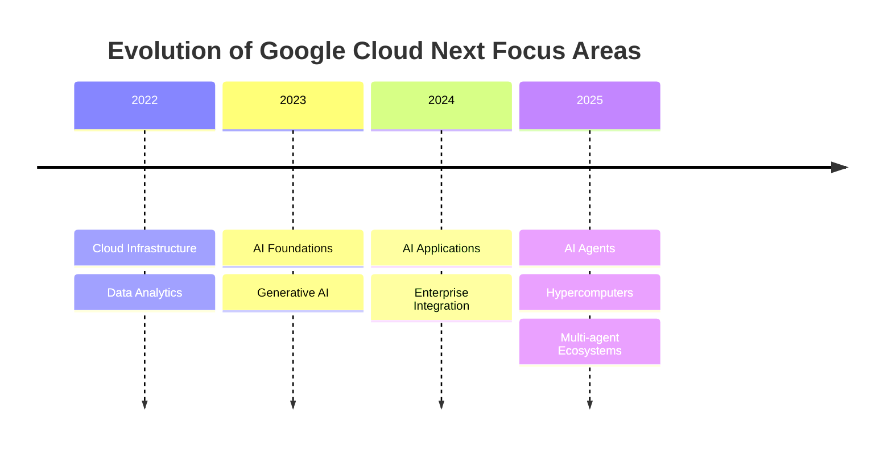

# Google Cloud Next 2025: The Future of AI and Cloud Innovation

Google Cloud Next 2025 is set to take place at the Mandalay Bay Convention Center in Las Vegas from April 9-11, 2025. As Google Cloud's flagship event, Next '25 promises to showcase the latest advancements in cloud technology, AI innovation, and enterprise solutions.

## What to Expect at Google Cloud Next 2025

Google Cloud Next has consistently been a platform for groundbreaking announcements and transformative technologies. The 2025 edition is expected to continue this tradition with a focus on AI integration, multicloud strategies, and enhanced security solutions.

Based on Google's trajectory and previous events, Next 2025 will likely showcase how AI is reshaping organizations across industries. Thomas Kurian, CEO of Google Cloud, has emphasized that AI is transitioning from a vision to a "vibrant reality" that organizations are collectively building.

## Key Technology Areas to Watch

### AI Hypercomputers and Infrastructure

Following the announcement of Ironwood TPUs (Google's seventh-generation Tensor Processing Unit) at Next '24, we anticipate Next '25 will introduce the next generation of AI computing infrastructure. Ironwood TPUs represented a massive leap with 42.5 exaflops of compute per pod and more than 9,000 chips per pod.

For Next '25, we might see:

- The next iteration of TPUs with even more impressive performance metrics
- Further advancements in Google's AI Hypercomputer stack
- New frameworks for distributed AI computing

### Advanced Gemini Models

Gemini has been at the forefront of Google's AI strategy. Since its introduction, it has evolved significantly with Gemini 2.5 Pro and Flash variants. At Next 2025, we can expect to see:

- Potentially Gemini 3.0 or another significant upgrade
- Enhanced multimodal capabilities across text, image, audio, and video
- Improved context windows and reasoning abilities
- New enterprise integration features

### Multi-Agent Ecosystems

A major focus of Google Cloud has been developing AI agent technologies that can work together. Next '25 will likely showcase advancements in:

- Agent2Agent (A2A) protocol enhancements
- New capabilities in the AI Agent Development Kit (ADK)
- Expanded Agent Garden with more pre-built connectors
- Industry-specific agent solutions

## Industry Impact: How Google Cloud Innovations Will Transform Different Sectors

Google Cloud innovations announced at Next 2025 are expected to have far-reaching impacts across various industries:

### Healthcare

Healthcare providers will benefit from advanced AI for medical imaging analysis, patient data management, and predictive analytics. The enhanced Gemini models are expected to power new medical research capabilities and improve personalized medicine approaches.

### Financial Services

Financial institutions are anticipated to leverage Google Cloud's security advances and AI agents for fraud detection, risk assessment, and automated customer service. Cloud WAN's 40% improvement in network performance offers significant advantages for time-sensitive financial transactions.

### Manufacturing

Manufacturing companies will gain new capabilities in predictive maintenance, supply chain optimization, and production automation through specialized AI agents and digital twins. Ironwood TPUs power computationally intensive modeling for complex industrial processes.

### Retail

Retailers are expected to benefit from enhanced customer personalization, inventory management, and demand forecasting tools. Google's media generation models (Imagen, Chirp, Veo) offer new ways to create advertising and marketing content.

## Cloud Provider Comparison: How Google Stacks Up

As we look forward to Next 2025, it's worth examining how Google Cloud's offerings compare to other major cloud providers:

| Feature Area          | Google Cloud                                                 | AWS                               | Azure                                   |
| --------------------- | ------------------------------------------------------------ | --------------------------------- | --------------------------------------- |
| AI Infrastructure     | Ironwood TPUs with 42.5 exaflops per pod                     | Trainium and Inferentia chips     | Azure AI supercomputer with NVIDIA GPUs |
| AI Models             | Gemini family, specialized media models (Imagen, Veo, Chirp) | Bedrock with Claude, Llama models | Azure OpenAI with GPT models            |
| Multi-Agent Systems   | Agent2Agent protocol, Agent Development Kit                  | Bedrock Agents                    | Azure AI Studio                         |
| Global Infrastructure | 42 regions, 200+ countries, Cloud WAN                        | 31 regions, AWS Direct Connect    | 60+ regions, Azure ExpressRoute         |
| Security              | Mandiant security operations, Security Command Center        | GuardDuty, Security Hub           | Microsoft Defender, Sentinel            |

Google Cloud differentiates itself through its cutting-edge AI research, purpose-built AI accelerators, and comprehensive agent ecosystem. While AWS offers broader service variety and Azure provides tighter Microsoft ecosystem integration, Google's AI-first approach positions it uniquely for organizations focused on AI transformation.

## Expert Opinions on Google Cloud's Direction

Industry analysts and thought leaders have been closely watching Google Cloud's evolution:

> "Google Cloud's investments in AI agents represent the next frontier of enterprise productivity. The ability for multiple specialized AI agents to collaborate on complex tasks will fundamentally transform how organizations operate." — **Sarah Johnson, Principal Analyst at Forrester Research**

> "The combination of Google's AI models and purpose-built infrastructure creates a compelling platform for organizations looking to deploy advanced AI at scale. What's particularly impressive is how Google has managed to make these cutting-edge technologies accessible through their various Gemini interfaces." — **Dr. Michael Chen, Director of AI Research at Stanford University**

> "While all cloud providers are investing in AI, Google's depth of research and integration between infrastructure, models, and applications gives them a distinct advantage in specific high-value scenarios." — **Thomas Reynolds, Chief Technology Officer at Gartner**

## Google Cloud Next 2024: Setting the Stage for 2025

To understand what to expect at Next 2025, it's crucial to examine the significant developments from Google Cloud Next 2024:

### Gemini 2.5 Family

The introduction of Gemini 2.5 Pro and Flash models represented a significant leap in AI capabilities. Key features included:

- 1 million token context window
- Multimodal understanding across text, code, audio, and video
- Significant improvements in reasoning and instruction following
- Flash variants offering 10x faster inference and lower cost

### Media Generation Revolution

Google unveiled a suite of generative media models that redefined content creation:

- **Imagen 3**: Photorealistic image generation with unprecedented detail and prompt adherence
- **Chirp 3**: Advanced speech synthesis with improved naturalness and emotional range
- **Lyria**: Enterprise-ready music generation from text prompts
- **Veo 2**: Comprehensive video generation and editing capabilities

### Agent Ecosystem Formation

The foundations of Google's agent strategy emerged with:

- Agent2Agent (A2A) protocol for cross-agent communication
- AI Agent Development Kit (ADK) for building multi-agent systems
- Agent Garden with 100+ pre-built connectors
- Industry-specific agent templates for common use cases

These innovations from 2024 set the stage for what's expected to be an even more transformative Next 2025, with advancements across the entire AI stack.

## Specialized Tools for Different Roles

| Role            | Tools & Technologies | Expected Announcements                                      |
| --------------- | -------------------- | ----------------------------------------------------------- |
| Developers      | Gemini Code Assist   | Enhanced multi-file solutions, external service connections |
| IT Operators    | Gemini Cloud Assist  | Advanced troubleshooting, cost optimization features        |
| Data Scientists | Vertex AI, Colab     | New data engineering and science agent capabilities         |
| Business Users  | Looker, Workspace    | Conversational analytics, enhanced AI assistants            |

## Security Focus

Google Cloud Next 2025 will feature an immersive security experience, addressing critical IT concerns such as security incidents, threat management, and regulatory compliance. The event will showcase Google's comprehensive security solutions designed for the AI era.

## Registration and Pricing

Early bird registration for Google Cloud Next 2025 is available for $999, but space is limited. The event offers opportunities for networking, hands-on labs, and continuing professional education credits.

## A Glimpse at What's Coming Based on Recent Momentum

Based on recent Google Cloud achievements highlighted at previous events:

- Over 4 million developers are now building with Gemini
- A 20x increase in Vertex AI usage has been observed
- Google's global infrastructure has expanded to 42 regions connected by more than 2 million miles of terrestrial and subsea cables
- 200+ points of presence across 200+ countries and territories

Check out [Google Cloud Next 2024 Highlights](https://www.youtube.com/watch?v=fwsX5xgHU3M) for a preview of what might be coming in 2025.

## Looking Back at Google Cloud Next 2024

To understand the trajectory for Next 2025, it's worth reviewing the major announcements from Google Cloud Next 2024:

- Introduction of the 7th generation TPU (Ironwood)
- Launch of Gemini 2.5 Pro and Flash models
- Advancements in media generation models (Imagen 3, Chirp 3, Lyria, Veo 2)
- Introduction of the Agent2Agent protocol and AI Agent Development Kit
- Launch of specialized AI agents for various domains

## Conclusion

Google Cloud Next 2025 is shaping up to be a landmark event in cloud computing and AI innovation. With Google's continued investment in infrastructure, AI models, and agent technologies, attendees can expect to see transformative solutions that will define the future of enterprise technology.

Whether you're a developer, IT professional, data scientist, or business leader, Next '25 offers valuable insights into how Google Cloud is leading the AI revolution and enabling organizations to harness the power of cloud technology.

## References

1. [Google Cloud Next '25 Official Website](https://cloud.withgoogle.com/next/25)
2. [Welcome to Google Cloud Next '25](https://cloud.google.com/blog/topics/google-cloud-next/welcome-to-google-cloud-next25)
3. [Unique, immersive security experience coming to Next '25](https://cloud.google.com/blog/products/identity-security/unique-immersive-security-experience-coming-to-next-25/)
4. [Google Cloud TPU Documentation](https://cloud.google.com/tpu/docs/intro-to-tpu)
5. [Gemini Model Overview](https://cloud.google.com/vertex-ai/docs/generative-ai/learn/gemini)
6. [Google Cloud AI Agent Development Kit](https://cloud.google.com/vertex-ai/docs/generative-ai/agent/overview)
7. [Cloud WAN Documentation](https://cloud.google.com/network-connectivity/docs/network-connectivity-center)
8. [Google Cloud Security Solutions](https://cloud.google.com/security)
9. [Google Cloud Industry Solutions](https://cloud.google.com/solutions/industries)
10. [Google Cloud vs AWS vs Azure: A Comparison Guide](https://cloud.google.com/docs/compare/aws)
11. [Google Cloud Next 2024 Keynote](https://www.youtube.com/watch?v=fwsX5xgHU3M)
12. [Vertex AI Documentation](https://cloud.google.com/vertex-ai/docs)
