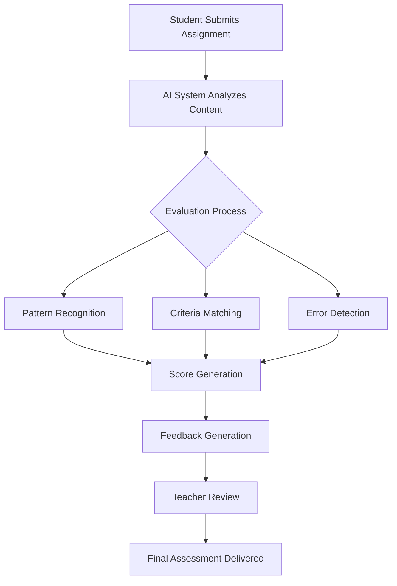
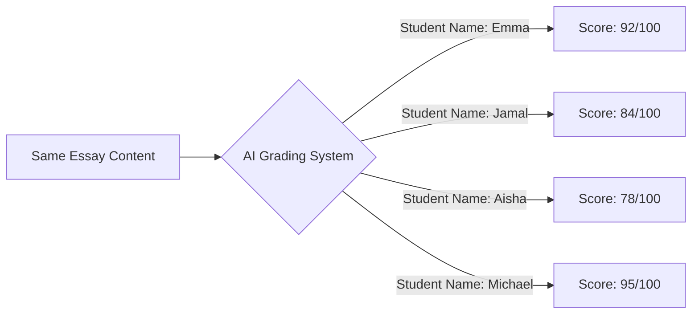

import { YouTubeVideo } from "../../components/mdx/YouTubeVideo";

# Revolutionizing Education: The Promise and Perils of AI-Powered Grading

In today's rapidly evolving educational landscape, artificial intelligence (AI) is transforming how teachers assess student work. With educators facing increasingly heavy workloads and the demand for timely feedback growing, AI-powered grading tools present an enticing solution. But as these technologies advance at breakneck speed, educators, administrators, and policymakers must carefully weigh their benefits against potential risks.

## The Growing Trend of AI in Grading

The use of AI for grading student work has gained significant momentum in recent years. A 2024 [EdWeek Research Center survey](https://www.edweek.org/technology/more-teachers-say-theyre-using-ai-in-their-lessons-heres-how/2025/03) found that about one-third of teachers use AI tools, with 13% employing them specifically to grade low-stakes assignments and 3% for high-stakes assessments. This trend reflects the mounting pressure on educators to provide timely feedback while managing ever-increasing workloads.

As one high school English teacher described it: "After tucking my son into bed, I'm hit with the realization that since waking up at 6:00 a.m., I've not had a moment's rest, nor have I managed more than brief exchanges with my wife. She's deeply engrossed in grading sixth-grade math quizzes, a world away in her concentration. Shifting my focus, I dive into assessing a substantial stack of high school history essays, with a firm deadline to return them by tomorrow."

## How AI Grading Tools Work

AI grading tools leverage advanced technologies like [natural language processing (NLP)](https://www.ibm.com/topics/natural-language-processing) and machine learning to analyze and evaluate student work. These systems can be trained on large datasets of previously graded assignments to recognize patterns and criteria that indicate quality work.

The process typically involves:

1. **Content Analysis**: The AI examines the structure, vocabulary, grammar, and content of the submission.
2. **Pattern Recognition**: The system identifies patterns that correlate with different quality levels.
3. **Criteria Matching**: The work is evaluated against rubric criteria programmed into the system.
4. **Feedback Generation**: Based on the analysis, the AI produces comments and suggestions for improvement.

## Benefits of AI-Powered Grading

### Time Efficiency and Reduced Workload

Perhaps the most compelling advantage of AI grading tools is their ability to drastically reduce the time teachers spend on assessment tasks.

**Average Hours Spent Grading 30 Essays:**

- Traditional Grading: 8.5 hours
- AI-Assisted Grading: 2.8 hours

According to data from several AI grading platforms, teachers can save between 70-90% of their grading time by using these tools. This efficiency allows educators to redirect their focus to more impactful activities, such as creating engaging lessons, providing individualized support, and addressing students' specific learning needs.

### Consistency and Objectivity

AI systems can apply grading criteria consistently across all student submissions, eliminating the "grading fatigue" that often affects human evaluators. As South Middle School English teacher Heather Van Otterloo noted, "By the time I get about halfway through marking a stack of essays, I know grading fatigue is about to hit me. I might skip leaving a comment that I would have taken the time to write 17 papers ago or be a bit more lenient with my overall evaluation."

### Immediate Feedback

Students benefit from the rapid turnaround time that AI grading facilitates. Instead of waiting days or weeks for feedback, they can receive immediate insights about their performance, allowing them to make corrections and improvements while the assignment is still fresh in their minds.

### Personalized Learning Opportunities

Advanced AI grading systems can identify patterns in a student's work over time, highlighting recurring strengths and weaknesses. This data-driven approach enables more personalized learning experiences and targeted interventions.

| Aspect          | Traditional Grading                   | AI-Assisted Grading                 |
| --------------- | ------------------------------------- | ----------------------------------- |
| Speed           | Slow (days to weeks)                  | Fast (minutes to hours)             |
| Consistency     | Variable (affected by fatigue, mood)  | High (applies same criteria to all) |
| Feedback Detail | Often limited by time constraints     | Can be extensive and specific       |
| Objectivity     | Potentially influenced by bias        | Less susceptible to human bias      |
| Cost            | Teacher time                          | Technology investment               |
| Personalization | Based on teacher knowledge of student | Based on data analysis              |

## Challenges and Ethical Concerns

Despite these advantages, AI grading tools come with significant challenges and ethical considerations that must be addressed.

### Bias and Fairness Issues

Research conducted by [ETS researchers Matt Johnson and Mo Zhang](https://hechingerreport.org/proof-points-asian-american-ai-bias/) revealed troubling biases in AI grading systems. After feeding ChatGPT more than 13,000 student essays previously graded by expert raters, they found the AI scored white, Black, and Hispanic students' writing 0.9 points lower on a 1-6 scale than humans, while Asian American students faced an even larger penalty of 1.1 points.

The study showed that GPT-4o gave Asian American students an average score of 3.2 compared to human evaluators' average of 4.3 on the same essays. Johnson and Zhang described this discrepancy as "substantial enough that it shouldn't be ignored," noting that the AI system is a "huge black box" of algorithms that operate in ways "not fully understood by their own developers."

Additionally, a 2023 [study of over 30 million Canvas grading records](https://papers.ssrn.com/sol3/papers.cfm?abstract_id=4603146) by Wang et al. revealed that AI grading can be affected by factors unrelated to content quality, such as the student's name. The research showed that students with surnames beginning with letters appearing later in the alphabet consistently received lower grades and more negative comments due to their position in the grading sequence.

These findings highlight how AI systems can perpetuate or even amplify existing societal biases, raising serious concerns about fairness and equity in assessment.

<YouTubeVideo
  videoId="EUg1l8l3Qps"
  title="Ethical Integration of Artificial Intelligence in the Classroom"
/>

### Limited Understanding of Context and Creativity

AI tools, while sophisticated, lack genuine understanding of student work. They cannot fully appreciate the nuance, creativity, and originality that human graders recognize. This limitation becomes particularly problematic when evaluating creative writing, critical thinking, or complex arguments.

As [MIT Sloan Teaching & Learning Technologies experts](http://mitsloanedtech.mit.edu/2024/05/09/ai-assisted-grading-a-magic-wand-or-a-pandoras-box/) note, "Using AI to grade subjective assignments raises concerns about bias and fairness. If an AI grading system is trained on a limited or biased dataset, it may inadvertently perpetuate or amplify existing inequities, disadvantaging certain groups of students."

A [2024 study by Tate et al.](https://hechingerreport.org/proof-points-ai-essay-grading/) at the University of California, Irvine, found that while ChatGPT could be "as good as an overburdened teacher" in scoring essays, it showed significant limitations in recognizing quality at the highest levels. In their analysis of 1,800 student essays, ChatGPT gave out only three perfect scores (6 out of 6) compared to humans who awarded 732 perfect scores to the same set of essays.

### Reliability and Consistency Concerns

While consistency is touted as a benefit of AI grading, research has shown that these systems can produce surprisingly variable results. One experiment demonstrated that simply changing a student's name on an identical essay resulted in score variations ranging from 78 to 95 out of 100 from the same AI system.

A [2024 study by Thomas et al.](https://arxiv.org/abs/2412.11255) found that when assessing AI systems' ability to evaluate tutor responses, even advanced models like GPT-4o demonstrated inconsistencies that highlighted the challenges of using AI for reliable assessment, particularly in contexts requiring nuanced understanding of equity and fairness.

### Privacy and Data Ownership Concerns

The use of AI grading tools raises important questions about student data privacy and intellectual property. When student work is uploaded to these systems, it may be used to train the AI further, potentially without explicit consent. This practice has significant implications for student privacy and ownership of their intellectual creations.

## Best Practices for Implementing AI Grading

To harness the benefits of AI grading while mitigating its risks, educators and institutions should consider the following best practices:

### Maintain Human Oversight

The "human in the loop" approach is essential for ethical and effective AI grading. Teachers should review AI-generated feedback and scores before sharing them with students, making adjustments as necessary based on their professional judgment and knowledge of individual students.

### Use AI as a Supplement, Not a Replacement

AI tools are most effective when used to support, not replace, human evaluation. Point Loma High School English teacher Jen Roberts describes her approach: "I first read through the paragraph and assign a score, often from 1-4. Then I ask AI to score the paragraph using the same grading criteria—and, importantly, offer feedback."

### Focus on Formative Assessment

AI grading is generally better suited for formative assessments and practice assignments rather than high-stakes evaluations. This approach allows students to benefit from rapid feedback while preserving the integrity of more consequential assessments.

### Be Transparent with Students

Educators should be open with students about when and how AI is being used in the grading process. This transparency builds trust and helps students understand the feedback they receive.

### Regularly Evaluate for Bias

Schools and educators should continuously monitor AI grading systems for potential biases and take steps to address any disparities that emerge.

## The Future of AI in Educational Assessment

As AI technology continues to evolve, we can expect more sophisticated and nuanced grading tools to emerge. However, the fundamental questions about the role of human judgment in education will remain.

The ideal future may lie in finding the optimal balance between human expertise and AI efficiency—leveraging technology to handle routine aspects of grading while preserving the irreplaceable human connection and insight that defines great teaching.

**Evolution of Grading Methods in Education (%)**

| Year   | Human Only | AI-Assisted | AI Only |
| ------ | ---------- | ----------- | ------- |
| 2020   | 85%        | 12%         | 3%      |
| 2022   | 65%        | 30%         | 5%      |
| 2024   | 42%        | 53%         | 5%      |
| 2026\* | 30%        | 60%         | 10%     |

\*Projected figures

## Conclusion: Finding the Right Balance

AI-powered grading tools offer tremendous potential to alleviate teacher workload and provide students with timely, consistent feedback. However, they also present significant challenges related to bias, equity, and the fundamental nature of educational assessment.

As Shallon Silvestrone and Jillian Rubman from [MIT Sloan](http://mitsloanedtech.mit.edu/2024/05/09/ai-assisted-grading-a-magic-wand-or-a-pandoras-box/) aptly put it: "AI-assisted grading is a powerful tool that can help faculty save time and provide students with timely feedback. However, it is not a magic wand that can replace human judgment and expertise."

The most promising approach is one that views AI as a partner in the grading process, handling routine aspects while allowing human educators to focus on the more complex, nuanced elements of student work. By maintaining this balance, we can harness the efficiency of AI while preserving the human connection that lies at the heart of meaningful education.

## References

- [EdWeek Research Center. (2024). Survey on AI Use in Education.](https://www.edweek.org/technology/were-at-a-disadvantage-and-other-teacher-sentiments-on-ai/2024/10)
- [Johnson, M., & Zhang, M. (2024). Bias in AI Grading Systems. Educational Testing Service.](https://hechingerreport.org/proof-points-asian-american-ai-bias/)
- [Schwartz, S. (2025, February 14). Is It Ethical to Use AI to Grade? Education Week.](https://www.edweek.org/technology/more-teachers-than-ever-before-are-trained-on-ai-are-they-ready-to-use-it/2025/04)
- [Silvestrone, S., & Rubman, J. (2024, May 9). AI-Assisted Grading: A Magic Wand or a Pandora's Box? MIT Sloan Teaching & Learning Technologies.](http://mitsloanedtech.mit.edu/2024/05/09/ai-assisted-grading-a-magic-wand-or-a-pandoras-box/)
- [Cutler, D. (2024, May 8). How AI Can Enhance the Grading Process. Edutopia.](https://www.edutopia.org/article/how-ai-can-enhance-the-grading-process/)
- [Scott, A. (2024). Understanding Ethics of AI in Education Progressing Towards Educational Equity. Medium.](https://medium.com/@alexmorganscott/understanding-ethics-of-ai-in-education-progressing-towards-educational-equity-2c65f8b77c3f)
- [Tate, T., et al. (2024). AI Essay Grading is Already as Good as an Overburdened Teacher. The Hechinger Report.](https://hechingerreport.org/proof-points-ai-essay-grading/)
- [Wang, Z., Pei, J., & Li, J. (2023). 30 Million Canvas Grading Records Reveal Widespread Sequential Bias and System-Induced Surname Initial Disparity. SSRN.](https://papers.ssrn.com/sol3/papers.cfm?abstract_id=4603146)
- [Thomas, D. R., et al. (2024). Do Tutors Learn from Equity Training and Can Generative AI Assess It? arXiv.](https://arxiv.org/abs/2412.11255)
