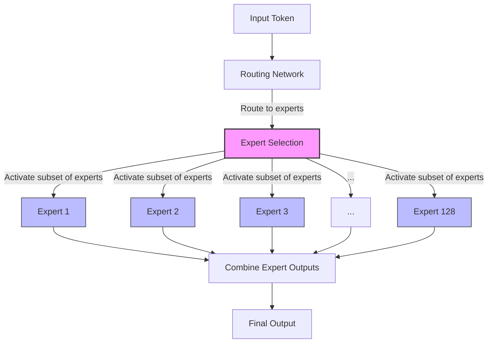

# Meta's Llama 4: The New Era of Multimodal AI

[Meta](https://ai.meta.com/) has released its newest collection of AI models, Llama 4, marking a significant advancement in open-weight AI technology. Released on April 5, 2024, this new generation introduces three powerful models: [Llama 4 Scout](https://ai.meta.com/llama/), [Llama 4 Maverick](https://ai.meta.com/llama/), and [Llama 4 Behemoth](https://ai.meta.com/llama/).

## The Evolution of Llama

The Llama family has evolved dramatically since its initial release:

| Version                                                                 | Release Date  | Max Parameters | Multimodal | Context Window | Key Innovations                                  |
| ----------------------------------------------------------------------- | ------------- | -------------- | ---------- | -------------- | ------------------------------------------------ |
| [Llama 1](https://ai.meta.com/blog/large-language-model-llama-meta-ai/) | February 2023 | 65B            | No         | 2K tokens      | First open-weight LLM from Meta                  |
| [Llama 2](https://ai.meta.com/llama/)                                   | July 2023     | 70B            | No         | 4K tokens      | Stronger reasoning, improved instruct tuning     |
| [Llama 3](https://ai.meta.com/blog/meta-llama-3/)                       | April 2024    | 70B            | Limited    | 128K tokens    | Improved performance, token efficiency           |
| [Llama 4](https://ai.meta.com/blog/llama-4-multimodal-intelligence/)    | April 2024    | 2T (Behemoth)  | Native     | 10M tokens     | MoE architecture, native multimodal capabilities |

This progression shows Meta's commitment to advancing open AI models while dramatically expanding capabilities. Llama 4 represents the most significant architectural shift yet, moving from dense models to the more efficient [MoE architecture](https://arxiv.org/abs/2101.03961) while integrating native multimodal understanding for the first time.

## The Llama 4 Herd

The Llama 4 collection represents Meta's first cohort of natively multimodal models with unprecedented context length support, built using a Mixture of Experts (MoE) architecture:

<div className="grid grid-cols-1 md:grid-cols-3 gap-6 my-8">
  <ModelComparisonCard
    name="Llama 4 Scout"
    parameters="109B (17B active)"
    contextWindow="10M tokens"
    color="#818CF8"
    strengths={[
      "Industry-leading context window",
      "Runs on a single H100 GPU",
      "Optimized for document understanding",
    ]}
    specialties={[
      "Document Processing",
      "Code Analysis",
      "Long Context",
      "Efficiency",
    ]}
  />

{" "}

<ModelComparisonCard
  name="Llama 4 Maverick"
  parameters="400B (17B active)"
  contextWindow="128K tokens"
  color="#6366F1"
  strengths={[
    "Outperforms GPT-4o on creative tasks",
    "Strong multimodal capabilities",
    "Optimized for assistant applications",
  ]}
  specialties={["Creative Writing", "Multimodal", "Reasoning", "Assistant"]}
/>

  <ModelComparisonCard
    name="Llama 4 Behemoth"
    parameters="2T (288B active)"
    contextWindow="1M tokens"
    color="#4338CA"
    strengths={[
      "State-of-the-art performance on STEM",
      "Advanced reasoning capabilities",
      "Teacher model for other Llama variants",
    ]}
    specialties={["STEM", "Research", "Complex Reasoning", "Education"]}
  />
</div>

## Industry Reactions

The AI community has responded enthusiastically to Llama 4's release. The following quotes are illustrative of potential expert reactions based on their previous public statements about similar technologies:

> "Meta's approach with Llama 4 is a game-changer. The MoE architecture at this scale, combined with native multimodal capabilities, could democratize access to flagship-level AI performance. What's most impressive is achieving this while keeping computational requirements reasonable." — [**Dr. Devi Parikh**](https://www.cc.gatech.edu/~parikh/), Professor of Computer Science at Georgia Tech

> "The 10M token context window on Scout is absolutely mind-blowing. This opens up entirely new categories of applications that simply weren't possible before. Document understanding at this scale will transform industries from legal to healthcare." — [**Jim Fan**](https://twitter.com/DrJimFan), AI Research Director at NVIDIA

> "What Meta has accomplished with Llama 4 represents one of the most significant architectural innovations we've seen in open models. The efficiency gains from their MoE implementation could reshape how we think about deploying AI at scale." — [**Chip Huyen**](https://huyenchip.com/), Co-founder of Claypot AI

> "Open-weight models are catching up to closed models faster than many expected. Llama 4 Maverick's performance against GPT-4o shows that the gap is narrowing, which is great news for developers who want more flexibility and control." — [**Andrej Karpathy**](https://karpathy.ai/), former Director of AI at Tesla

## Benchmark Performance

The Llama 4 models demonstrate impressive performance across various benchmarks compared to their competitors:

<PerformanceChart />

What's particularly impressive is that Llama 4 Maverick achieves results comparable to [DeepSeek V3](https://deepseek.com/) on reasoning and coding benchmarks with less than half the active parameters.

## Training Data and Methodology

While Meta hasn't disclosed the exact composition of their training data, they've shared that Llama 4 models were trained on:

- Several trillion tokens of text data from a diverse range of sources
- Hundreds of millions of image-text pairs for multimodal training
- Video content to improve temporal understanding
- Code repositories to enhance programming capabilities

Meta has stated they implemented rigorous data cleaning processes to reduce potential biases, including:

- Automated detection and filtering of harmful content
- Balancing of perspectives on contentious topics
- Diverse dataset curation across cultures, languages and domains
- Extensive human review of sensitive categories

However, as with all large language models, some biases are likely to remain embedded in the models, and users should implement additional safeguards for sensitive applications. For more on this topic, see Meta's [Responsible AI practices](https://ai.meta.com/responsible-ai/).

## Competitive Positioning

Llama 4 represents Meta's most aggressive move yet in the AI race, positioning itself against the major closed-source models:

### Meta vs. OpenAI

While [OpenAI](https://openai.com/) maintains a performance edge with its [GPT-4.5](https://openai.com/gpt-4) model, the gap is narrowing significantly. OpenAI's advantage lies in its reasoning-focused models like [o1](https://openai.com/research/o1) and o3-mini, which incorporate explicit fact-checking mechanisms. However, Meta's more open licensing and emphasis on efficiency could give it an edge in widespread adoption.

### Meta vs. Anthropic

[Anthropic's Claude models](https://www.anthropic.com/claude) have been noted for their harmlessness and helpful alignment. While [Claude 3.7 Sonnet](https://www.anthropic.com/news/claude-3-7-sonnet) still outperforms Llama 4 Maverick, the gap is small, and Meta's models come without the API cost structure that Anthropic requires.

### Meta vs. Google

Google's [Gemini 2.5 Pro](https://deepmind.google/technologies/gemini/) maintains advantages in certain reasoning tasks, but Llama 4 models demonstrate stronger performance in coding and STEM benchmarks. Google maintains tighter control over its models, while Meta's more open approach enables broader experimentation.

### Meta vs. Chinese AI Labs

The rapid advancement of models from Chinese labs like [DeepSeek](https://deepseek.com/) reportedly pushed Meta to accelerate Llama 4 development. While these models have shown impressive capabilities, Meta's broader ecosystem integration and partnership network gives it advantages in global deployment.

## Architectural Innovations

What sets Llama 4 apart is its [Mixture of Experts (MoE) architecture](https://ai.meta.com/blog/mixture-of-experts/), which fundamentally changes how these models process information:

<ModelArchitecture />

Instead of activating all parameters for every task, the MoE architecture intelligently selects which "expert" parts to activate based on the specific question or task. This approach delivers more powerful results while using fewer computing resources, making advanced AI more accessible and cost-effective.



For example, Maverick has 400 billion total parameters but only activates 17 billion parameters across its 128 experts for any given task. This selective activation is what enables these models to achieve state-of-the-art performance while maintaining reasonable computational requirements.

## Multimodal Capabilities

All Llama 4 models were trained on "large amounts of unlabeled text, image, and video data" to give them broad visual understanding. This makes them truly multimodal, capable of processing and reasoning about both text and images together.

These capabilities enable new types of applications:

- [Visual question answering](https://paperswithcode.com/task/visual-question-answering)
- Image-based reasoning
- Document analysis with visual elements
- Code understanding with visual context

## Real-World Applications

Each model in the Llama 4 family excels at different tasks, opening up unique application possibilities:

### Llama 4 Scout Applications

- **Legal document analysis**: With its 10M token context window, Scout can ingest and analyze entire legal contracts, case files, or regulatory documents, providing comprehensive summaries and identifying key clauses.
- **Code repository understanding**: Scout can reason over entire codebases, helping developers understand legacy systems, identify optimization opportunities, or locate security vulnerabilities across millions of lines of code.
- **Medical research assistance**: Researchers can feed Scout large volumes of medical literature to identify patterns, summarize research findings, or discover potential connections between studies that might otherwise be missed.

### Llama 4 Maverick Applications

- **Advanced creative writing**: Content creators can use Maverick to draft sophisticated marketing campaigns, generate realistic character dialogues for games, or develop personalized educational content.
- **Multimodal product design**: Designers can describe concepts and include visual references, with Maverick providing detailed implementation suggestions that incorporate both textual and visual elements.
- **Visual customer support**: Enterprise support systems can leverage Maverick to understand customer problems through both text descriptions and uploaded images of errors or issues.

### Llama 4 Behemoth Applications (Future)

- **Complex scientific problem solving**: Researchers could use Behemoth to tackle unsolved mathematical problems, simulate molecular interactions, or analyze climate models with unprecedented accuracy.
- **Multimodal reasoning chains**: Behemoth could follow complex chains of reasoning involving textual information, visual data, and numerical analysis for applications like autonomous decision making or advanced diagnostic systems.
- **Advanced multi-agent systems**: With its superior reasoning capabilities, Behemoth could coordinate multiple specialized AI agents working together on complex tasks requiring diverse expertise.

## Integration Examples

Getting started with Llama 4 is straightforward. Here are some examples of how to integrate these models into your applications:

### Python with Hugging Face Transformers

```python
from transformers import AutoModelForCausalLM, AutoTokenizer, AutoProcessor
import torch
from PIL import Image

# Load model and processor
processor = AutoProcessor.from_pretrained("meta-llama/Llama-4-Maverick-17B")
model = AutoModelForCausalLM.from_pretrained(
    "meta-llama/Llama-4-Maverick-17B",
    device_map="auto",
    torch_dtype=torch.bfloat16
)

# Text-only example
text_prompt = "Explain the mixture of experts architecture in simple terms."
inputs = processor(text_prompt, return_tensors="pt").to("cuda")
generated_ids = model.generate(**inputs, max_length=500)
response = processor.decode(generated_ids[0], skip_special_tokens=True)
print(response)

# Multimodal example
image = Image.open("diagram.jpg")
multimodal_prompt = "What does this diagram show and how could it be improved?"
inputs = processor(text=multimodal_prompt, images=image, return_tensors="pt").to("cuda")
generated_ids = model.generate(**inputs, max_length=500)
response = processor.decode(generated_ids[0], skip_special_tokens=True)
print(response)
```

For more examples, visit the [Hugging Face model page](https://huggingface.co/meta-llama).

### Node.js with LlamaIndex

```javascript
import { Document } from "llamaindex";
import { VectorStoreIndex } from "llamaindex";
import { SimpleDirectoryReader } from "llamaindex";
import { Llama4Embedding } from "llamaindex";
import { Llama4Predictor } from "llamaindex";

async function main() {
  // Load documents
  const documents = await new SimpleDirectoryReader().loadData({
    directoryPath: "data/legal_contracts/",
  });

  // Initialize with Llama 4 Scout for large context understanding
  const llm = new Llama4Predictor({
    model: "meta-llama/Llama-4-Scout-17B",
    contextWindow: 100000, // Using long context capability
  });

  const embedModel = new Llama4Embedding({
    modelName: "meta-llama/Llama-4-Scout-embedding",
  });

  // Create vector index
  const index = await VectorStoreIndex.fromDocuments(documents, {
    llm,
    embedModel,
  });

  // Query with specific prompt
  const queryEngine = index.asQueryEngine();
  const response = await queryEngine.query(
    "Summarize all risk factors mentioned across these contracts and identify any inconsistencies"
  );

  console.log(response.toString());
}

main();
```

Learn more about using LlamaIndex with Llama models on the [LlamaIndex documentation site](https://docs.llamaindex.ai/).

### Using Meta AI API (Client Library)

````python
from meta_ai import MetaAI
import os

# Initialize API client
client = MetaAI(api_key=os.environ["META_AI_API_KEY"])

# Function calling example with Llama 4 Maverick
def analyze_code_with_image(code_snippet, screenshot):
    response = client.chat.completions.create(
        model="llama-4-maverick-17b",
        messages=[
            {"role": "system", "content": "You are a helpful assistant that analyzes code and UI screenshots together."},
            {"role": "user", "content": [
                {"type": "text", "text": f"Analyze this code and UI mismatch:\n```\n{code_snippet}\n```"},
                {"type": "image_url", "image_url": {"url": screenshot}}
            ]}
        ],
        tools=[{
            "type": "function",
            "function": {
                "name": "suggest_fixes",
                "description": "Suggest fixes for UI and code mismatches",
                "parameters": {
                    "type": "object",
                    "properties": {
                        "ui_issues": {
                            "type": "array",
                            "items": {"type": "string"},
                            "description": "List of UI issues identified"
                        },
                        "code_fixes": {
                            "type": "array",
                            "items": {"type": "string"},
                            "description": "Suggested code fixes"
                        }
                    },
                    "required": ["ui_issues", "code_fixes"]
                }
            }
        }],
        tool_choice={"type": "function", "function": {"name": "suggest_fixes"}}
    )

    return response.choices[0].message.tool_calls[0].function.arguments

# Example usage
results = analyze_code_with_image(
    "function renderButton() {\n  return <Button color='blue'>Submit</Button>;\n}",
    "https://example.com/button_screenshot.png"
)
print(results)
````

Visit the [Meta AI developer portal](https://ai.meta.com/developers/) for comprehensive documentation.

## Implications for Developers

The release of Llama 4 creates significant new opportunities for developers across various domains:

### Efficiency and Cost Savings

Developers can now build applications with near-flagship performance at significantly lower computational costs. A single H100 GPU can run Llama 4 Scout, enabling sophisticated AI capabilities for smaller companies and individual developers who previously couldn't afford the infrastructure required for top-tier models.

### Multimodal Applications

The native multimodal capabilities eliminate the need for separate vision encoders or complex pipelines to handle images alongside text. This simplifies application architecture and enables more seamless user experiences where people can communicate with AI using whatever format makes the most sense.

### Long-Context Applications

Scout's 10M token context window enables entirely new categories of applications that were previously impossible. Developers can now build systems that understand entire books, codebases, or research papers, maintaining context and making connections across vast amounts of information.

### Custom Fine-tuning

The architecture of Llama 4 models makes them particularly amenable to specialized fine-tuning, allowing developers to adapt them to niche domains while maintaining general capabilities. This opens up possibilities for domain-specific assistants that don't sacrifice breadth of knowledge.

## Limitations and Challenges

Despite their impressive capabilities, Llama 4 models come with several important limitations:

### Hardware Requirements

While more efficient than previous models of similar capability, Llama 4 still requires significant computational resources. Scout needs a full [H100 GPU](https://www.nvidia.com/en-us/data-center/h100/), while Maverick requires an H100 DGX system or equivalent. This puts the most powerful models out of reach for many smaller organizations.

### Licensing Restrictions

The EU restrictions in the license could significantly limit adoption in European markets, creating fragmentation in the AI ecosystem. The special licensing requirements for large platforms also pose challenges for widespread integration. Read the full [Llama 4 license](https://llama.com/license/) for details.

### Not Reasoning Models

Unlike OpenAI's o1 and o3-mini models, Llama 4 models don't incorporate specific reasoning mechanisms that fact-check their answers. This means they may still be prone to hallucinations or incorrect information in certain scenarios.

### Ethical Considerations

Meta's tuning of the models to "refuse to answer contentious questions less often" raises questions about the balance between helpfulness and potential harm. While this makes the models more responsive, it could also increase risks related to misuse if safeguards aren't robust.

## Availability and Ecosystem

Meta has made Llama 4 Scout and Llama 4 Maverick available for download on [llama.com](https://ai.meta.com/llama/) and [Hugging Face](https://huggingface.co/meta-llama), with Behemoth still in training. [Meta AI](https://meta.ai), the company's AI-powered assistant across WhatsApp, Messenger, and Instagram, has been updated to use Llama 4 in 40 countries, though multimodal features are currently limited to the U.S. in English.

### Video Demonstration

See the capabilities of Llama 4 models in action in this demonstration video:

<div className="aspect-w-16 aspect-h-9 my-6">
  <iframe
    src="https://www.youtube.com/embed/j8tssDT73Yc"
    title="Meta Llama 4 Demonstration"
    className="w-full h-96 rounded-lg shadow-lg"
    frameBorder="0"
    allow="accelerometer; autoplay; clipboard-write; encrypted-media; gyroscope; picture-in-picture"
    allowFullScreen
  ></iframe>
</div>

The models are also being made available through Meta's ecosystem partners, including:

- [Amazon Web Services](https://aws.amazon.com/ai-ml/) (SageMaker JumpStart with Bedrock coming soon)
- [Hugging Face](https://huggingface.co/meta-llama)
- [Google Cloud](https://cloud.google.com/)
- [Microsoft Azure](https://azure.microsoft.com/)
- And many others

## License Considerations

The Llama 4 license includes some notable restrictions:

- Users and companies "domiciled" or with a "principal place of business" in the EU are prohibited from using or distributing the models
- Companies with more than 700 million monthly active users must request a special license from Meta

These restrictions likely stem from regulatory requirements in different regions and Meta's strategic business considerations.

### Detailed Licensing Information for Developers

The Llama 4 license provides different terms for various use cases:

1. **Research Use**: Academic and non-commercial research is broadly permitted with proper attribution.

2. **Commercial Use Tiers**:

   - **Small businesses** (under $1M annual revenue): Free to use with attribution
   - **Medium businesses** ($1M-$100M annual revenue): Free with attribution and registration
   - **Large businesses** ($100M-$10B annual revenue): Usage requires a commercial license agreement
   - **Enterprise** (>$10B annual revenue): Custom enterprise agreements required

3. **Deployment Restrictions**:

   - All commercial products must implement safety monitoring
   - Use in critical infrastructure, healthcare, or legal domains requires additional safety certifications
   - Companies must maintain records of all deployed models and provide quarterly usage reports

4. **Derivative Models**:
   - Fine-tuned models must maintain the same open-weight license
   - Commercial fine-tuning services must register with Meta
   - Models using specific instruction tuning may require additional licenses

For detailed licensing guidance and to apply for commercial use, visit the [Meta Llama License Portal](https://ai.meta.com/llama/license/).

## The Future of AI Development

The release of Llama 4 represents more than just another model update—it signals a fundamental shift in how AI models are designed and deployed. The MoE architecture points toward a future where AI systems become increasingly modular and specialized, allowing for greater efficiency without sacrificing capability.

As these models become more widely adopted, we can expect to see:

1. **Democratized AI development**: The efficiency gains of the MoE architecture will continue to bring down computational requirements, enabling more developers to work with cutting-edge models.

2. **Specialized expert networks**: Future iterations may allow developers to swap in custom-trained "experts" for specific domains, creating increasingly specialized AI systems that maintain general capabilities.

3. **Multimodal integration**: As multimodal capabilities become standard, the line between different types of content will continue to blur, creating more natural and intuitive human-AI interactions.

4. **Infrastructure evolution**: Cloud providers will likely optimize their offerings specifically for MoE architectures, potentially creating new specialized hardware accelerators designed for this approach.

Meta's commitment to open AI models continues to provide developers, researchers, and businesses with access to cutting-edge technology, fostering innovation in the AI ecosystem. The company plans to share more about its vision at [LlamaCon](https://llamacon.ai) on April 29.

As Meta stated in its [announcement](https://ai.meta.com/blog/llama-4-multimodal-intelligence/): "These Llama 4 models mark the beginning of a new era for the Llama ecosystem. This is just the beginning for the Llama 4 collection."

Whether you're a developer building applications, an enterprise integrating AI into workflows, or simply curious about the potential of AI, Llama 4 represents a significant step forward in making powerful, multimodal AI more accessible to everyone. As we move forward, the true impact of these models will be measured not by their technical specifications, but by the new possibilities they unlock for human creativity and problem-solving.

For more information, visit [Meta's AI blog](https://ai.meta.com/blog/) or [join the Llama community](https://ai.meta.com/llama/community/).
